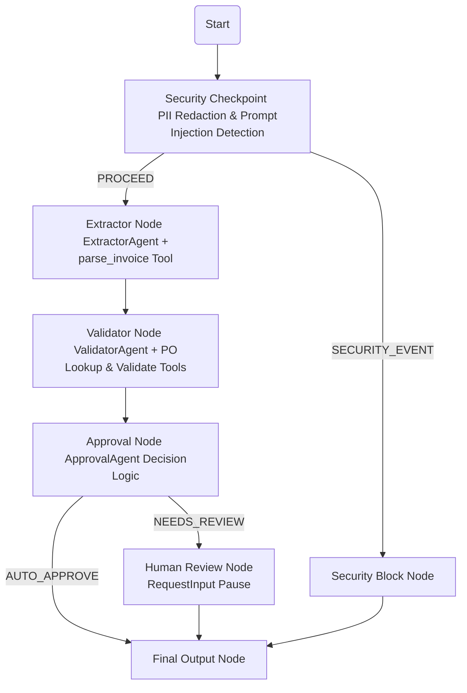

# Submission Write-Up: Smart Invoice Agent

## Problem Statement
In modern financial operations, processing accounts payable invoices manually is a tedious, error-prone, and slow process. Accounts departments must check invoices for formatting, extract metadata, verify the details against Purchase Orders (POs), flag variances, and assess vendor risks. Furthermore, feeding raw external documents directly into LLM-driven applications introduces security concerns, such as:
1. **PII Leakage:** Accidental transmission of sensitive details (SSN, credit cards, bank accounts) to external models.
2. **Prompt Injection:** Malicious inputs designed to hijack the model and bypass company approval policies.

The **Smart Invoice Agent** solves this by structuring invoice processing into a secure, automated multi-agent workflow that validates every document against internal systems via MCP tools and flags risky files for human review.

---

## Solution Architecture
The workflow represents a Directed Acyclic Graph (DAG) using the ADK 2.2.0 Workflow API:

---

## Concepts Used

### 1. ADK Workflow Graph
Implemented in [app/agent.py](file:///c:/Users/home/Documents/Srushi%20Folder/adk_workspace/smart-invoice-agent/app/agent.py#L344-L377), the system uses the new ADK 2.2.0 tuple-based edge definition (`edges=[...]`) to link functional `@node` decorator functions.

### 2. Specialized LlmAgents
- **ExtractorAgent** (defined in `extractor_node` in [app/agent.py](file:///c:/Users/home/Documents/Srushi%20Folder/adk_workspace/smart-invoice-agent/app/agent.py#L139-L151)): Focuses exclusively on extracting raw unstructured text into structured JSON invoice data.
- **ValidatorAgent** (defined in `validator_node` in [app/agent.py](file:///c:/Users/home/Documents/Srushi%20Folder/adk_workspace/smart-invoice-agent/app/agent.py#L176-L189)): Cross-checks invoice data with PO records fetched through MCP.
- **ApprovalAgent** (defined in `approval_node` in [app/agent.py](file:///c:/Users/home/Documents/Srushi%20Folder/adk_workspace/smart-invoice-agent/app/agent.py#L221-L233)): Applies corporate decision matrices to determine auto-approval or human review.

### 3. Agent Delegation (`ctx.run_node`)
Instead of direct execution, sub-agents are executed via `await ctx.run_node(agent, input_text)` from within the workflow node functions, which ensures the session state is properly tracked.

### 4. MCP Server
Exposed in [app/mcp_server.py](file:///c:/Users/home/Documents/Srushi%20Folder/adk_workspace/smart-invoice-agent/app/mcp_server.py) using the Model Context Protocol (FastMCP). It runs over standard I/O (stdio) transport, allowing the agents to communicate with internal mock databases.

### 5. Security Checkpoint Node
Located at the entry point of the workflow in [app/agent.py](file:///c:/Users/home/Documents/Srushi%20Folder/adk_workspace/smart-invoice-agent/app/agent.py#L98-L130). It acts as a gateway safeguarding downstream agents.

### 6. Agents CLI
The application structure is scaffolded using `google-agents-cli` and run using the `adk web` command line utilities for local playground UI development.

---

## Security Design

1. **PII Scrubbing:** Raw invoice text is passed through regular expression filters in `_scrub_pii` to detect and redact SSNs, Credit Cards, Bank Accounts, Passports, and Email Addresses before being sent to the LLM.
2. **Prompt Injection Guard:** String scanning against known injection heuristics (e.g. "ignore previous instructions") prevents jailbreaks. If detected, the system logs a `CRITICAL` severity security audit log and routes to `security_block_node`.
3. **Structured Audit Logs:** On every node transition and decision, the agent prints a structured JSON audit log entry with `timestamp`, `event_type`, `severity` (INFO/WARNING/CRITICAL), and metadata to stdout.
4. **Amount Integrity Warning:** Emits a warning if no monetary amounts are found, identifying malformed invoice submissions immediately.

---

## MCP Server Design
The Model Context Protocol server exposes five domain-specific tools:
1. `parse_invoice`: Parses raw text using heuristic patterns to return key structured JSON fields.
2. `lookup_purchase_order`: Queries the internal PO registry to return matching PO details (vendor, approved amount, etc.).
3. `validate_invoice_against_po`: Performs cross-validation checks, calculates percentage variance, and evaluates risk levels.
4. `calculate_payment_terms`: Computes early payment discounts, late payment fees, and final due dates.
5. `get_vendor_risk_profile`: Fetches risk profiles, payment history scores, and dispute flags for a specific vendor.

---

## Human-in-the-Loop (HITL) Flow
To protect the company against large disbursements and high-risk invoices, the workflow pauses when:
- The invoice total exceeds `$50,000.00`.
- The `risk_level` is evaluated as `MEDIUM` or `HIGH` by the `ValidatorAgent`.
- Discrepancies (vendor mismatches or >5% amount variances) are found.

In these cases, the workflow routes to `human_review_node`, invoking the `RequestInput` long-running tool. The flow halts, displays the invoice summary to the reviewer, and awaits an `APPROVE` or `REJECT` input.

---

## Demo Walkthrough

### Test Case 1: Auto-Approved Invoice
- **Action:** Send a standard invoice for Acme Supplies Ltd matching `PO-2024-001`.
- **Result:** Security checks pass, details are extracted, PO lookup matches exactly, and the agent auto-approves.
- **Log output:** `[AUDIT] {"event": "APPROVAL_DECISION", "severity": "INFO", "details": {"decision": "AUTO_APPROVE", ...}}`

### Test Case 2: Human Escalation
- **Action:** Send an invoice with an amount discrepancy (e.g., invoice is $52,000 vs PO $48,000).
- **Result:** Validator Agent flags the variance and high risk. Approval Agent chooses `NEEDS_REVIEW` and the UI prompts the user to enter `APPROVE`/`REJECT`.
- **Log output:** `[AUDIT] {"event": "HUMAN_REVIEW_COMPLETE", "severity": "INFO", ...}`

### Test Case 3: Prompt Injection Block
- **Action:** Send a payload containing malicious system instructions.
- **Result:** Security Checkpoint flags the text, routes to `security_block_node`, and immediately blocks execution.
- **Log output:** `[AUDIT] {"event": "INJECTION_DETECTED", "severity": "CRITICAL", ...}`

---

## Impact / Value Statement
The **Smart Invoice Agent** automates accounts payable processing with safety and reliability. By checking details against purchase orders in real-time, it prevents overpayments and payment disputes. By using multi-layer PII scrubbing and prompt injection checks, it ensures company data remains secure. Ultimately, the agent cuts down manual validation times from hours to seconds while maintaining high-grade corporate security compliance.
